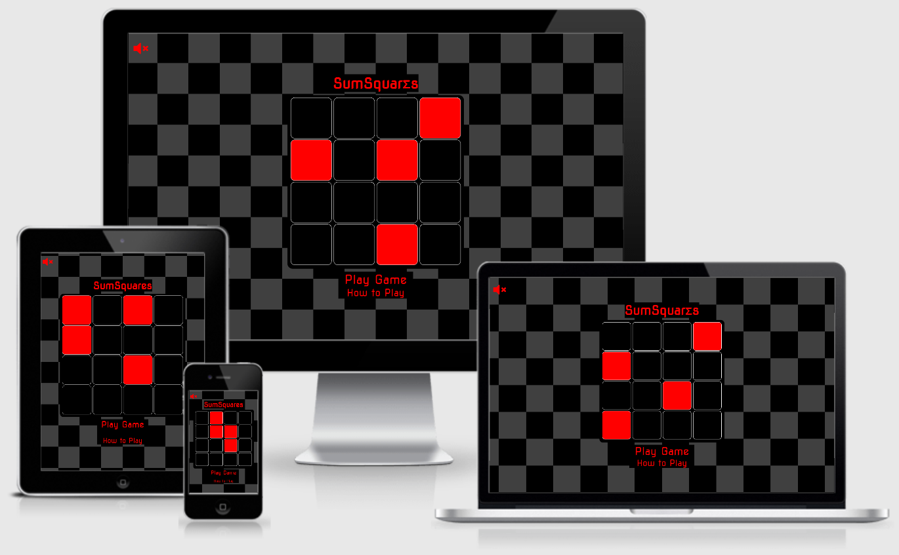

<h1 align="center">SumSquares</h1>

<a href="https://danwilliams91.github.io/SumSquares/">Link to the deployed website.</a>

SumSquares is a web-based game which tests the user's counting speed. For each stage of the game, a random number of red squares are made visible and the player must count the total number of red squares before the 5-second timer runs out. Each stage gets progressively more difficult with the total number of potential red squares increasing and their sizes decreasing, as well as the number of irrelevant squares increasing. During the later stages of the game, players are also shown green squares as a distraction. The game begins as a seemingly easy game which anyone can play, but the difficulty level of the latter stages of the game make it almost impossible to beat!

<!--Below image sourced from sourced from http://ami.responsivedesign.is/-->

## User Experience (UX)
* ### User Stories
    * #### New User Goals
        a)  As a new user, I want to easily and quickly be able to find out how to play the game.

        b)  As a new user, I want to be able to play the game intuitively and without the need of much prior knowledge and experience.

    * #### Returning User Goals
        a)  As a returning user, I want to be able to quickly play the game without undue delay.

        b)  As a returning user, I want there to be a feature which shows the progress I’ve made in the game so I can challenge myself to beat my high score.

* ### Design
    * #### Colour Scheme
        * The chosen colour scheme for the site is a simple black, white and grey combination for backgrounds and non-interactive elements. This has been done so as not to distract the user from the more important elements of the site, such as text—which is a clear red colour—and coloured squares, which are the main focus of the game.
        * The colour red is used for the squares which the player must count, as well as the colour of all squares when the player answers incorrectly.
        * The colour lime is used for the distracting squares during the later stages of the game, as well as the colour of all squares when the player answers correctly and for the final animation when the player completes the game.

    * #### Typography
        * The font used throughout the site is Nova Square – a font which was chosen based on the shape of its characters being square-like, and the general aesthetics of the font being arcade-like. This was considered a perfect combination which matches the intended style of the website.

* ### Wireframes
    * <a href="assets/docs/wireframes/game-landing.png" target="_blank">Prior to user interaction.</a>
    * <a href="assets/docs/wireframes/game-instructions.png" target="_blank">Game instructions.</a>
    * <a href="assets/docs/wireframes/game-mid-stages-ready.png" target="_blank">Stage ready to play (mid-level stage).</a>
    * <a href="assets/docs/wireframes/game-start.png" target="_blank">Countdown prior to game stage being in-play.</a>
    * <a href="assets/docs/wireframes/game-early-stages-countdown.png" target="_blank">Stage in-play (early stages).</a>
    * <a href="assets/docs/wireframes/game-mid-stages-countdown.png" target="_blank">Stage in-play (mid stages).</a>
    * <a href="assets/docs/wireframes/game-later-stages-countdown.png" target="_blank">Stage in-play (later stages).</a>
    * <a href="assets/docs/wireframes/game-early-stage-input.png" target="_blank">User input at end of stage.</a>
    * <a href="assets/docs/wireframes/game-early-stage-correct-answer.png" target="_blank">Player answered correctly.</a>
    * <a href="assets/docs/wireframes/game-early-stage-incorrect-answer.png" target="_blank">Player answered incorrectly.</a>
    * <a href="assets/docs/wireframes/game-completed.png" target="_blank">Player completed game.</a>

## Features
* Game music and sound effects are present but optional. The page initially loads with <a href="assets/docs/screenshots/game-muted.png" target="_blank">sounds muted</a> and the user has the option to <a href="assets/docs/screenshots/game-unmuted.png" target="_blank">unmute</a> and mute the sounds throughout the game via the clickable sound icon.
* The input box for the player to input their answer only allows numeric values to prevent accidental entry and the player losing their progress. When a non-numeric value is submitted, a <a href="assets/docs/screenshots/non-numeric-prompt.png" target="_blank">prompt</a> is displayed to inform the user that only numeric values are able to be submitted.
* When the player clicks “Exit Game” when the game is in play (i.e. not on the landing page), a <a href="assets/docs/screenshots/exit-confirmation.png" target="_blank">popup</a> is displayed in the browser window, which informs the user that they will lose their progress if the game is exited. The game will only exit if the player selects "OK" from this popup.
* Each element of the page which accepts user interaction can be navigated to using the “Tab” button on devices with keyboards. When one of these elements are focussed on, a <a href="assets/docs/screenshots/play-highlighted.png" target="_blank">red box</a> surrounds it to allow the user to determine which element they will be selecting when clicking the “Space” or “Enter” keys.	
* If the viewport height-to-width ratio is insufficient for the proper display of the game (such as when viewing the page in a landscape orientation on smaller devices), the content of the page is hidden and an <a href="assets/docs/screenshots/rotate-prompt.png" target="_blank">overlaying message</a> is displayed to ask the user to rotate their device. This ensures that the game is displayed correctly when played.

## Technologies Used
### Languages Used
* <a href="https://en.wikipedia.org/wiki/HTML5" target="_blank">HTML5.</a>
* <a href="https://en.wikipedia.org/wiki/CSS" target="_blank">CSS3.</a>
* <a href="https://en.wikipedia.org/wiki/JavaScript" target="_blank">JavaScript.</a>

### Frameworks, Libraries & Programs Used
1. <a href="https://balsamiq.com/wireframes/" target="_blank">Balsamiq:</a>
    * Balsamiq was used to create the wireframes during the design process.
2. <a href="https://fontawesome.com/" target="_blank">Font Awesome:</a>
    * Font Awesome is used as the source of the mute-toggle and help icons.
3. <a href="https://git-scm.com/" target="_blank">Git:</a>
    * Git was used for version control by utilizing the Gitpod terminal to commit to Git and Push to GitHub.
4. <a href="https://github.com/" target="_blank">GitHub:</a>
    * GitHub is used to store the projects’ code after being pushed from Git.
5. <a href="https://fonts.google.com/" target="_blank">Google Fonts:</a>
    * Google fonts is used to import the “Nova Square” font into the style.css file which applies the font to all text displayed on the website.
6. <a href="https://jestjs.io/" target="_blank">Jest:</a>
    * Jest was used for the automated testing of JavaScript.
7. <a href="https://jquery.com/" target="_blank">jQuery:</a>
    * The jQuery 3.6.0 JavaScript library is used to simplify the JavaScript code used in the relevant files.
8. <a href="https://www.microsoft.com/en-us/microsoft-365/excel" target="_blank">Microsoft Excel:</a>
    * Microsoft Excel was used to create the site’s background image and to test the mathematical calculations of the JavaScript functions which set the number of coloured squares for each stage of the game.
9. <a href="https://en.wikipedia.org/wiki/Microsoft_Paint" target="_blank">Microsoft Paint:</a>
    * Microsoft Paint was used to edit screenshots taken for the purposes of this README document.
10. <a href="https://www.microsoft.com/en-us/microsoft-365/word" target="_blank">Microsoft Word:</a>
    * Microsoft Word was used to draft the README document and continually update it throughout the development process.
11. <a href="https://twistedwave.com/online" target="_blank">TwistedWave:</a>
    * The TwistedWave online audio editor was used to edit the sound files.

## Testing
### HTML and CSS Validation

The W3C Markup Validator and W3C CSS Validator Services were used to validate the site’s page to ensure there were no syntax errors present.

* <a href="https://validator.w3.org/" target="_blank">W3C Markup Validator</a>
    * <a href="https://validator.w3.org/nu/?doc=https%3A%2F%2Fdanwilliams91.github.io%2FSumSquares%2F" target="_blank">Results</a>
* <a href="https://jigsaw.w3.org/css-validator/" target="_blank">W3C CSS Validator</a>
    * <a href="https://jigsaw.w3.org/css-validator/validator?uri=https%3A%2F%2Fdanwilliams91.github.io%2FSumSquares%2F&profile=css3svg&usermedium=all&warning=1&vextwarning=&lang=en" target="_blank">style.css file results.</a>

### JavaScript Testing

The <a href="https://jshint.com/" target="_blank">JSHint tool</a> was used to test the JavaScript code and to identify any errors present.

* Automated Testing
  * During the initial stages of the project, automated testing was implemented. The original intention was to use this method throughout the project; however, it was later identified that this method was more time-consuming and an inefficient testing method for this particular project. Following a small number of initial tests, it was decided that manual testing was more suited to the project and no further automated testing was performed.

* Manual Testing
  * Throughout the entirety of the project, manual testing was utilised to ensure that functions worked as intended and user feedback behaved as expected. This involved extensive use of in-browser testing where <a href="https://developer.chrome.com/docs/devtools/" target="_blank">Chrome DevTools</a> was used to control and monitor JavaScript variable values.

### Testing User Stories from User Experience (UX) Section
* #### New User Goals
    a)  As a new user, I want to easily and quickly be able to find out how to play the game.
    * Upon first visiting the game’s webpage, the text <a href="assets/docs/screenshots/how-to-play.png" target="_blank">"How to Play"</a> is clearly visible at the bottom of the page. Clicking this will show the user the <a href="assets/docs/screenshots/instructions.png" target="_blank">instructions</a> of the game.
    * A clickable <a href="assets/docs/screenshots/help-icon.png" target="_blank">icon</a> is also visible once the game begins, which also shows the game <a href="assets/docs/screenshots/instructions2.png" target="_blank">instructions</a> when clicked on.

    b)  As a new user, I want to be able to play the game intuitively and without the need of much prior knowledge and experience.
    * In addition to the in-depth instructions mentioned above, as soon as the player clicks "Play Game", and before each subsequent stage begins, the <a href="assets/docs/screenshots/mini-instr.png" target="_blank">stage instructions</a> are shown immediately above the <a href="assets/docs/screenshots/go.png" target="_blank">"GO!"</a> button which the player must interact with before the stage begins. This makes it simple for anyone to understand how to play the game.
    
* #### Returning User Goals
    a)  As a returning user, I want to be able to quickly play the game without undue delay.
    * Players are not forced to view the game instructions before playing and can immediately begin the game by clicking <a href="assets/docs/screenshots/play-game.png" target="_blank">"Play Game"</a> on the landing page. This allows returning users to quickly play the game upon first entering the wwebsite.

    b)  As a returning user, I want there to be a feature which shows the progress I’ve made in the game so I can challenge myself to beat my high score.
    * From the moment the game begins, a section below the play area displays the <a href="assets/docs/screenshots/stage-info.png" target="_blank">current stage</a> of the game.
    * When the player answers incorrectly and the game ends, the game confirms <a href="assets/docs/screenshots/stage-info-end.png" target="_blank">which stage the player has reached</a> so they know how far they were able to progress.

### Further Testing
* The Website was tested on Google Chrome, Mozilla Firefox and Microsoft Edge browsers.
* The website was viewed on a variety of devices such as Desktop, Laptop, iPhone 11 and Google Pixel 5.
* Friends and family members were asked to review the site and documentation to identify any bugs and/or user experience issues.

### Bugs
* The code to update the number of squares in the grid at each progressive stage initially added new squares to the already-existing squares within the grid. When using this method, it was found that the CSS styling was not being applied to the new squares correctly, and the spacing of the new squares was non-existent compared to the existing squares.  
    * To fix this, the code now removes all existing squares from the grid and re-adds an entire grid of new squares. Margin styling has been added to the CSS file to space out the squares on the grid, although the margins may no longer be fully symmetrical due to using this workaround.
* Clicking on the heading element of the page, whilst the game is in play, shows an alert box to allow the player to confirm that they want to exit the game and, in doing so, will lose their progress. During testing, it was found that, whilst the alert box was showing, the game—including the in-stage timer—was paused, enabling the player to have an unlimited amount of time to count the red squares.
    * This was rectified by only allowing the clicking of this link whilst the in-stage timer is not active. When the timer is running, clicking the link results in no action.
* During the later stages of development, and during manual testing, it was discovered that the formulae used to set the number of red squares in the grid—when the game was in-play—resulted in some stages having the same number of squares every time the game was played. This removed the randomness of the earlier stages, which is an important element of the game.
    * The formulae were tested using Microsoft Excel and were revised following trial-and-error methods; the results of which now ensures that each stage is no longer guaranteed to contain a set number of red squares, whilst also ensuring that the game difficulty increases with the progression of stages.
* During manual testing, it was found that, on some rare occasions, the initially hidden elements were visible for a very short time whilst the page loaded. This was when the elements were hidden using JavaScript.
    * To rectify this issue, the elements which are not meant to be displayed on the loading of the page have been assigned a class of “hidden”, which is targeted by CSS to ensure the relevant elements are hidden without the need of the JavaScript file to be loaded. A new function has also been added to the JavaScript file to hide the elements and then remove the “hidden” class. This ensures that the elements remain hidden when there is a problem or a delay with the loading of the JavaScript file.
* When the mute icon is toggled using a device keyboard, the icon is no longer selected. The icon also automatically deselects when a soundtrack is looped once it has ended.
    * This is a minor inconvenience which doesn't affect the playability of the game in any way, so no attempt has been made to fix this bug as the developer has considered it an inefficient use of time for the scope of the project.

## Further Development

There are many opportunities for further development of the site, some of which are listed below. Although these aspects and features can be implemented, the developer has decided that they are outside the scope of the project and the additional time spent on their implementation would bring no further value when considering the project's scope.

* An option to share their final progress of the game to social media or to external messaging services would bring additional value to its users and the developer.
  * In terms of the site's users, they could involve their friends and compete with each other for the highest score.
  * In terms of the site owner/developer, having its users share the game with a link would bring additional traffic to the site. This can increase the developer's reputation and potentially bring opportunities for advertising revenue.
* The game is very difficult to complete so difficulty options and "lifelines" could bring further value to the game's users.
  * Including difficulty levels such as "easy," "medium" and "hard," for example, would allow more users to be able to complete the game and could improve the enjoyment level for some of its users.
    * Options to adjust difficulty levels could include increasing the in-stage timer value, reducing the number of red squares and/or removing the distracting green squares during the later stages of the game.
  * Providing players with a certain number of "lifelines" could enhance the playability of the game. Such "lifelines" could include increasing the value of the stage timer, reducing the number of red squares by a certain percentage or being provided with a choice of how many red squares there were in a given stage.
* Additional options to customise the colours used in the game could be provided to users.
  * Including such customisable options could provide a more enjoyable experience to the site's users.
  * Additionally, this option may be beneficial to users with certain forms of colour vision deficiencies (although this topic hasn't been researched by the developer).

## Deployment
### GitHub Pages

The project was deployed to GitHub Pages using the following steps:

1.  Log in to GitHub and locate the <a href="https://github.com/DanWilliams91/SumSquares" target="_blank">GitHub Repository.</a>
2.  At the top of the Repository (not top of page), locate the "Settings" Button on the menu.
3.  Scroll down the Settings page until you locate the "GitHub Pages" Section.
4.  Under "Source", click the dropdown called "None" and select "Master Branch".
5.  The page will automatically refresh.
6.  Scroll back down through the page to locate the now published site link in the "GitHub Pages" section.

### Forking the GitHub Repository

By forking the GitHub Repository we make a copy of the original repository on our GitHub account to view and/or make changes without affecting the original repository by using the following steps:

1.  Log in to GitHub and locate the <a href="https://github.com/DanWilliams91/SumSquares" target="_blank">GitHub Repository.</a>
2.  At the top of the Repository (not top of page) just above the "Settings" Button on the menu, locate the "Fork" Button.
3.  You should now have a copy of the original repository in your GitHub account.

### Making a Local Clone
1.  Log in to GitHub and locate the <a href="https://github.com/DanWilliams91/SumSquares" target="_blank">GitHub Repository.</a>
2.  Under the repository name, click "Clone or download".
3.  To clone the repository using HTTPS, under "Clone with HTTPS", copy the link.
4.  Open Git Bash.
5.  Change the current working directory to the location where you want the cloned directory to be made.
6.  Type <em>git clone</em> and then paste the URL you copied in Step 3.
7.  Press Enter. Your local clone will be created.

<a href="https://help.github.com/en/github/creating-cloning-and-archiving-repositories/cloning-a-repository#cloning-a-repository-to-github-desktop" target="_blank">Click Here</a> to view more detailed explanations of the above process.

## Credits
### Code
* The JavaScript code responsible for shuffling an array (in particular, the shuffleArray(array) function) was sourced from <a href="https://www.geeksforgeeks.org/how-to-shuffle-an-array-using-javascript/" target="_blank">this GeeksforGeeks webpage.</a>

### Media
* All the website's sounds were sourced from <a href="https://pixabay.com/" target="_blank">Pixabay.</a>
* Sounds were edited using the <a href="https://twistedwave.com/online" target="_blank">TwistedWave online audio editor.</a>

### Acknowledgements
* My Mentor, Gerard McBride, for continuous helpful feedback.
* Tutor support at Code Institute for their support.
* My friend, Colin French, and my partner, Nicola Williams, for assisting with site testing on different devices and providing valuable feedback.

